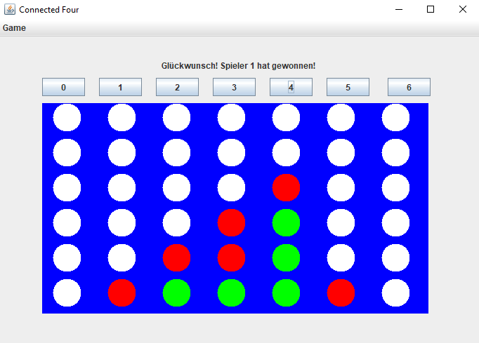
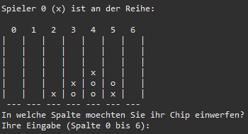

# Connect Four (Vier gewinnt)

Es wurde das klassische Spiel Connect Four (Vier gewinnt) als offline multiplayer Spiel programmiert.
Zwei Spielende werfen abwechselnd Münzen in einer festen Farbe in das Raster. Befinden vier Münzen gleicher Farbe horizontal, vertikal oder diagonal nebeneinander, gewinnt der Spieler mit dieser Farbe.

In der Main Funktion kann ausgewählt werden, ob das Spiel als GUI Anwendung oder in der Kommandozeile ausgeführt werden soll.

## Installation und Ausführung
Zur Installation und Ausführung wird am besten das gesamte Projekt in eine IDE geladen. Dann kann auch in der main Methode in der Datei Game.java, gewählt werden, ob das Programm als GUI Anwendung oder in der Kommandozeile ausgeführt werden soll.

## Screenshots

GUI Anwendung. Spieler 1 hat gewonnen:

Kommandozeile. Spieler 0 ist an der Reihe:

Copyright (C) 2024 Michael